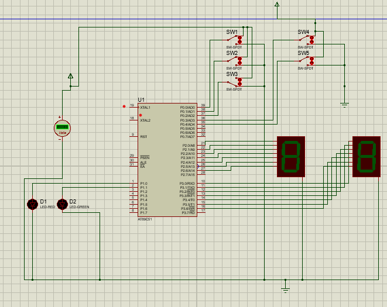
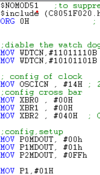
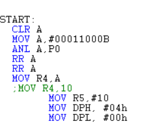
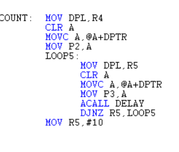
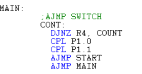
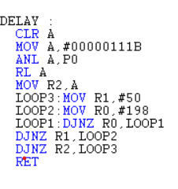
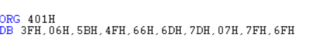

# Traffic-Lights-Control-System

# TASK DESCRIPTION	
> A basic traffic light system for the AT89S52 micro controller programed in assembly, with the ability to control the speed of counting (LOW, MED, HIGH) and the MAX count (between 20, 40, 60)

## Simulation:

## Code Configuration

> Config our code and set the bit 0 in port 1 with high (light the red led initially) .
 Start Label

> The first part of this label is used get the values of the bits from bit 3 to bit 5 (switches to vary MAX value of the counter)
The second part is to initialize the Data pointer with the base location of the Data Base (#400H) that contains the look up table of the seven segments. 

## Count Label

  

. The first part of this label is used to increment the data pointer each time to get the equivalent encoding of the seven segments (from 0 to MAX Count to show in the left seven segment)
We can select the MAX period to be 20, 40, 60 (stored in R4 register).
The second part is used to iterate on the right seven segments (from 0 to 9)

## MAIN Label

> In the main label we iterate on the value stored in register 4 which contains the MAX period that we selected (20, 40, 60). Then complement bit 0 in port 1 (the red led to turn off since it was initially given high to led up), also complementing bit 1 in port 1  (the green led to turn on since it was initially given low), then iterate to light the red led again for the max period selected and then light the green led for the same period

## DELAY Label

> In this part we choose the speed of counting (either LOW, MED,  HIGH) based on the value of the switches in bit 3 and bit 4 of port 0 or the combination of the two switches.
Then delay the time for showing every value in the seven segment by (R2 * 50 *198) *CLK of the microcontroller.

## LOOK UP Table for the seven segments

> Creating Data base to store the look up table for the seven segments.
